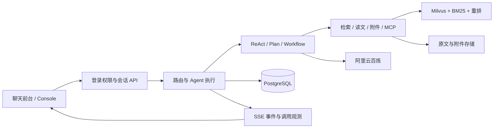

# Totoro Nexus

面向知识问答与运维辅助的可配置 Agent 平台，包含聊天前台、管理 Console 和评测工作台。可持续创建 Agent、上传维护知识库、生成与管理评测集，覆盖“资料入库 → 配置调试 → 对话使用 → 评测迭代”。

Java 17 · Spring Boot · Spring AI · PostgreSQL · Milvus · Lucene BM25 · 阿里云百炼 · Docker Compose

**[GitHub 仓库](https://github.com/SiyuJi-SHU/Totoro-Nexus) · [v1.0.0 发布与源码下载](https://github.com/SiyuJi-SHU/Totoro-Nexus/releases/tag/v1.0.0) · [自动测试](https://github.com/SiyuJi-SHU/Totoro-Nexus/actions/workflows/ci.yml)**

<!-- public-demo-status:start -->
**在线演示：[Totoro Nexus](https://elective-cash-revival.ngrok-free.dev/)**（需向作者索取体验账号；首次访问可能出现 ngrok 的 Visit Site 提示）。演示运行在作者本机，电脑、Docker 和隧道在线时可访问。Console 需要管理员角色。
<!-- public-demo-status:end -->

## 能做什么

| 能力 | 实现范围 |
|---|---|
| Agent 配置 | 按需创建、启停和版本管理；配置模型、指令、知识范围、工具权限与调用预算 |
| 三种执行模式 | ReAct 自主工具调用、Plan–Execute–Replan 分阶段执行、Workflow 运维分析 |
| 知识库维护 | 知识库与数据集管理、资料上传与删除、文档版本、分块入库和索引更新 |
| RAG 与附件 | 向量 / BM25 / 混合检索、RRF 融合、可选重排、分段读文、引用校验及多轮附件问答 |
| 评测集管理 | 从知识库生成候选案例、证据检查与人工确认；导入、追加和删除案例，派生 Agent 任务案例 |
| 调试与评测 | 单次召回测试、批量召回及 Agent / Workflow 评测；Hit@K、MRR、证据覆盖、逐题检查与失败归因 |
| 对话与观测 | 前台多轮对话和历史；SSE 过程事件、上游首包、模型与工具耗时、Token 用量和运行回放 |
| 权限与交付 | ADMIN / MEMBER 权限、管理 Console、Docker Compose 与统一 Windows 启动入口 |

已有演示 Agent 只是当前配置，平台不固定为这几个角色。Workflow 使用模拟告警与日志提供诊断建议，不执行生产修复。SSE 推送执行过程，知识问答的结构化答案完成校验后展示，不等于全文逐字输出。

## 当前电脑日常使用

在本项目目录双击 **`启动平台.cmd`**。它检查 Docker 和本地服务、打开页面，并启动或复用已配置的 ngrok 外链；外链连接失败时本地平台仍可使用。

- [聊天前台](http://localhost:9900/) · [管理 Console](http://localhost:9900/console.html)
- 已有账号、Agent、知识库和历史继续沿用。日常启动无需重新构建、复制配置模板或导入数据。
- 演示期间保持电脑唤醒、Docker 与网络在线；Console 需要管理员角色，公网与本地共用同一套数据。

首次下载源码的安装步骤见下方。各文件用途与备份方法见 [部署、数据与恢复](docs/deployment.md)。

## 平台使用流程

1. **维护资料**：在 Console 创建知识库与数据集，上传资料，查看文档版本、分块与入库状态。
2. **配置 Agent**：创建 Agent，选择执行模式、LLM、知识范围、工具权限及预算，在 Console 调试后从前台使用。
3. **检查召回**：输入问题查看召回结果、排名和原文；可将确认的目标片段保存为召回案例。
4. **建立评测集**：从知识库生成候选问题与参考答案，人工确认后保存，或导入已有案例；继续追加并建立对应 Agent / Workflow 任务案例。
5. **评测与迭代**：查看召回指标、逐题回答、引用与工具轨迹，定位失败环节；调整配置后按需要复测。

生成评测案例、模型判分和真实对话可能消耗 API 额度，日常启动不会自动执行评测。召回命中不等于回答正确；Console 的“配置一致”表示历史结果与当前配置匹配，不表示最新构建已经重跑过全量评测。

## 架构



详细设计：[模块与代码导航](docs/architecture.md) · [执行模式与边界](docs/execution-modes.md)

## 新机器首次安装

准备 Docker Desktop、JDK 17 和 Maven，克隆仓库或解压 Release 源码。以下仅用于**没有既有配置和业务数据的新安装**，在项目根目录执行：

```powershell
Copy-Item .env.example .env
# 编辑 .env，填写自己的百炼 API Key 和数据库密码。
./scripts/start.ps1
```

首次构建完成后打开 [聊天前台](http://localhost:9900/) 或 [Console](http://localhost:9900/console.html)。初始账号为 `admin`，生成的密码位于 `runtime/uploads/.platform/admin-initial-password.txt`，登录后修改。

安装完成后日常使用 `启动平台.cmd`。未配置外链时仍可本地使用。[完整部署说明](docs/deployment.md) · [可选外链配置](docs/ngrok-demo.md)

全新安装需要在 Console 导入 [示例资料](examples/knowledge/README.md)、配置知识库和 Agent。GitHub 源码不包含作者的账号、已有 Agent 配置、聊天历史或私人附件，也不会自动复制线上演示的数据。

## 目录

```text
Totoro-Nexus/
├─ src/              后端、前台、Console、数据库迁移与测试
├─ scripts/          构建、启动与验收辅助
├─ deploy/           网关和外链配置
├─ eval/             示例评测案例
├─ examples/         可导入资料及来源许可
├─ docs/             架构、部署和验收记录
├─ docker-compose.yml
└─ 启动平台.cmd       日常统一启动入口
```

运行后生成的 `runtime/`、`target/`、私有 `.env` 和本机 `backups/` 均不进入仓库。账号、Agent 和对话保存在 PostgreSQL 数据卷；原文、附件及向量服务文件保存在 `runtime/`。备份与恢复须同时保留这两部分，见 [数据与恢复](docs/deployment.md#数据位置)。

Docker 的 `totoro-nexus-prod` 负责应用与存储，`totoro-nexus-demo` 负责外链网关，两组共用同一套业务程序和数据。

## 验证

`v1.0.0` 发布已通过本地及 GitHub CI 验证：297 项 Java 测试（6 项真实外部测试跳过），24 项前端测试，0 失败、0 错误。CI 未配置模型密钥，不执行付费模型评测。

```powershell
mvn test
node --test src/test/js/*.test.js scripts/workbench-contract.test.cjs
```

普通自动化测试使用本地桩与测试数据库；真实模型测试需要显式开启。`scripts/accept_*.py`、`scripts/verify_runtime_replay.py` 和 Console 评测会调用实际服务、可能产生费用，不在自动 CI 中运行。

[已完成验收与已知限制](docs/acceptance.md) · [历史 RAG 评测](docs/rag-v2-verification.md)

## 发布与保存

`v1.0.0` 是固定源码发布基线，`main` 可包含后续文档修订。程序功能已冻结；更新 README 不需要重新构建容器或重跑评测。Release 源码 ZIP 约 2.73 MB，包含代码、测试、部署脚本、文档和公开示例资料。

GitHub 用于保存和分发源码；恢复当前账号、Agent、聊天、附件和知识库，还需要 PostgreSQL 备份、`runtime/` 中的配套数据及私有配置。它们不上传公开仓库，见 [一致性备份](docs/deployment.md#一致性备份)。

## 许可

项目代码采用 [Apache-2.0](LICENSE)。示例资料遵循各自来源许可，见 [来源说明](examples/knowledge/README.md)；项目许可不替代第三方资料与角色形象的权利归属。
