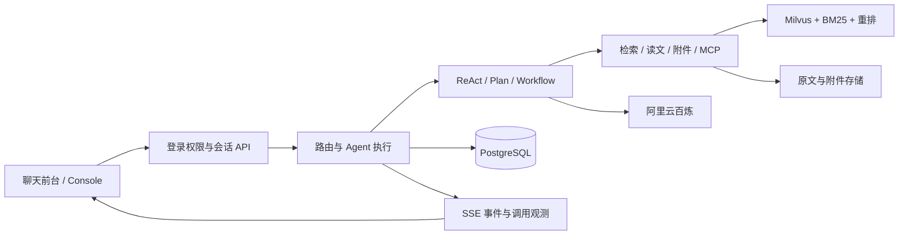

# Totoro Nexus

一个可配置的知识 Agent 与运维分析平台，包含聊天前台、管理 Console 和评测工作台。

Java 17 · Spring Boot · Spring AI · PostgreSQL · Milvus · Lucene BM25 · 阿里云百炼 · Docker Compose

<!-- public-demo-status:start -->
**在线演示：[Totoro Nexus](https://elective-cash-revival.ngrok-free.dev/)**（需向作者索取体验账号；首次访问可能出现 ngrok 的 Visit Site 提示）。演示运行在作者本机，电脑、Docker 和隧道在线时可访问。Console 需要管理员角色。
<!-- public-demo-status:end -->

## 能做什么

| 能力 | 实现范围 |
|---|---|
| Agent 配置 | 模型选择、指令、知识范围、工具权限、调用预算与版本管理 |
| 三种执行模式 | ReAct 自主工具调用、Plan–Execute–Replan 分阶段执行、Workflow 运维分析 |
| RAG 与附件 | 向量 / BM25 / 混合检索、重排、分段读文、来源引用及多轮附件问答 |
| 执行观测 | SSE 过程事件、模型与工具耗时、Token 用量、运行记录与回放 |
| Console 与评测 | 账号权限、资料版本、Agent 调试、召回指标和逐题回答评测 |

Workflow 使用模拟告警与日志提供诊断建议，不执行生产修复。SSE 推送执行过程，结构化答案完成校验后展示，不等于全文逐字输出。评测成绩对应各自记录的模型、配置、资料和时间，不能视为任意输入下的质量保证。

## 架构



详细设计：[模块与代码导航](docs/architecture.md) · [执行模式与边界](docs/execution-modes.md)

## 本地运行

**首次安装（Windows PowerShell）**：准备 Docker Desktop、JDK 17 和 Maven，然后在项目根目录执行：

```powershell
Copy-Item .env.example .env
# 编辑 .env，填写自己的百炼 API Key 和数据库密码。
./scripts/start.ps1
```

首次构建完成后打开 [聊天前台](http://localhost:9900/) 或 [Console](http://localhost:9900/console.html)。初始账号为 `admin`，生成的密码位于 `runtime/uploads/.platform/admin-initial-password.txt`，登录后修改。

**后续使用只需双击 `启动平台.cmd`**：启动本地项目、打开页面，并连接已配置的 ngrok 外链。未配置外链时仍可本地使用。[完整部署说明](docs/deployment.md) · [可选外链配置](docs/ngrok-demo.md)

全新安装需要在 Console 导入 [示例资料](examples/knowledge/README.md)、配置知识库和 Agent。GitHub 源码不包含作者的账号、六个已配置 Agent、聊天历史或私人附件，也不会自动复制线上演示的数据。

## 目录

```text
Totoro-Nexus/
├─ src/              后端、前台、Console、数据库迁移与测试
├─ scripts/          构建、启动与验收辅助
├─ deploy/           网关和外链配置
├─ eval/             示例评测案例
├─ examples/         可导入资料及来源许可
├─ docs/             架构、部署和验收记录
├─ docker-compose.yml
└─ 启动平台.cmd       日常统一启动入口
```

运行后生成的 `runtime/`、`target/`、私有 `.env` 和本机 `backups/` 均不进入仓库。账号、Agent 和对话保存在 PostgreSQL 数据卷；原文、附件及向量服务文件保存在 `runtime/`。备份与恢复须同时保留这两部分，见 [数据与恢复](docs/deployment.md#数据位置)。

Docker 的 `totoro-nexus-prod` 负责应用与存储，`totoro-nexus-demo` 负责外链网关，两组共用同一套业务程序和数据。

## 验证

```powershell
mvn test
node --test src/test/js/*.test.js scripts/workbench-contract.test.cjs
```

普通自动化测试使用本地桩与测试数据库；真实模型测试需要显式开启。`scripts/accept_*.py`、`scripts/verify_runtime_replay.py` 和 Console 评测会调用实际服务、可能产生费用，不在自动 CI 中运行。

[已完成验收与已知限制](docs/acceptance.md) · [历史 RAG 评测](docs/rag-v2-verification.md)

## 许可

项目代码采用 [Apache-2.0](LICENSE)。示例资料遵循各自来源许可，见 [来源说明](examples/knowledge/README.md)；项目许可不替代第三方资料与角色形象的权利归属。
