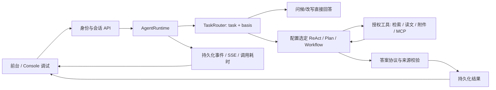

# 功能架构与代码导航

平台由前台对话、管理 Console、共享 Agent 运行时、知识检索和评测组成。Agent 是可新增和维护的版本化配置，不需要为每个角色复制一套服务。

## 模块职责

| 模块 | 主要位置 | 职责 |
|---|---|---|
| 前台对话 | `src/main/resources/static/platform-workbench*` | Agent 选择、会话、附件、来源、SSE 过程与分段耗时 |
| Console | `src/main/resources/static/console.html`、`platform-console*` 及同目录模块 | Agent/模型/工具配置、知识库与数据集、版本、调试与评测 |
| HTTP 与权限 | `org.example.platform.*Controller`、`PlatformSecurity`、`PlatformIdentity` | 管理/成员边界、登录、REST API 与 SSE |
| Agent 生命周期 | `PlatformCatalog`、`AgentLifecycleService`、`AgentRunStore` | 配置版本、固定会话范围、运行状态与事件 |
| 意图与执行 | `AgentRuntime`、`TaskRouter`、三个 Executor | 意图决定依据要求，Agent 配置决定执行模式 |
| 共享执行能力 | `AgentExecution`、`AgentToolRegistry`、`McpConnections` | 工具权限、调用预算、MCP 与提交协议 |
| RAG | `KnowledgeIngestion`、`KnowledgeSearch`、`VersionedVectorIndex`、`LexicalIndex` 及 service 层 | 分块入库、向量/BM25/混合召回、重排与正文窗口 |
| 文件与附件 | `SourceStorage`、`DocumentCatalog`、`SessionAttachmentService` | 原文版本、附件所有权、分段读取和来源关联 |
| 答案与引用 | `AnswerSubmission`、`SourceSpans`、`AgentAnswerService`、诊断校验器 | 输出协议、原文引用回填、确定性校验与报告渲染 |
| 模型与观测 | `ChatModelFactory`、`ModelDeadline`、`UsageLedger` | 模型选择、请求期限、上游流状态、Token 与耗时 |
| 评测 | `PlatformEvaluation`、`PlatformEvaluationController`、`eval/` | 候选案例生成与确认、案例导入维护、召回/Agent/Workflow 评测、版本与配置追溯 |
| 存储 | PostgreSQL、`runtime/uploads/`、Milvus/etcd/MinIO | 结构化记录、文件原文、本地索引、向量持久化 |

Java 包路径均以 `src/main/java/` 为根。部分兼容 API 和数据库迁移仍被当前页面或历史记录使用，不能因名称含 Legacy 或版本号就删除。

## 一次对话

配置模型支持按 Agent 替换。历史保留最近四条有结果的对话及必要诊断锚点；不存在无限记忆或自动总结所有早期对话。改写单独标识最近一次回答；明确排除附件时只在该轮排除，不删除会话文件。

附件阶段使用自动原生工具选择；最终需要整理时，通过已有 finish 步骤输出 JSON，与工具选择分开。保留原来的校验与超时规则。Workflow 并行 Worker 的耗时不能简单相加当总耗时。

## 部署关系

`docker-compose.yml` 管理 app、PostgreSQL、Milvus、etcd、MinIO；Attu 是可选 profile。`deploy/public-demo/` 是可选入口部署，不包含另一套业务代码或数据库。

迁移保持 Compose 项目名 `totoro-nexus-prod` 和 PostgreSQL 数据卷名。宿主文件移到 `runtime/`，容器内部仍是 `/app/uploads`、`/app/eval` 等原路径，因此数据库中的历史附件路径无需改写。
