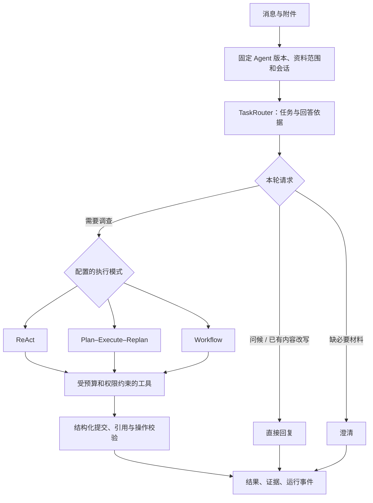

# 执行模式与模块边界

Console 配置同一平台的 Agent，前台创建固定版本会话。不是每个 Agent 都有一套独立后端，也不是由意图识别随意切换算法。

## 回答依据与 Prompt

TaskRouter 产生 task 与 basis。`GENERAL` 是通识讨论，`SOURCED` 是必须查证的事实，`MIXED` 是事实与一般分析并存，`TRANSFORM` 是只处理本次消息或已有回答，`NONE` 是无知识事实的寒暄。basis 不预测知识库有没有答案。

配置中的任务说明进入 System Prompt；平台追加资料边界、工具预算、回答协议和禁止捏造等规则。工具的名称、参数 Schema 与描述通过 function calling 提供，两者共同约束模型。实际权限、次数和引用校验由代码执行，不能只靠提示词。

改写已有报告时单独提供 previousResponse（最近有结果的回答）及 earlierConversation，再传本次请求，不再附带“必须输出完整诊断报告”的业务模板，防止改写与诊断要求冲突。事实核验和补充反证仍进入需要证据的链路。

## 三种模式

| 模式 | 用途 | 执行方式 |
| --- | --- | --- |
| ReAct | 知识问答、基于资料的解释 | 模型逐步选工具，看到结果后决定继续或提交；重复请求和工具预算受控 |
| Plan–Execute–Replan | 需要分步骤查证的问题 | 规划目标，执行时生成真实参数，观察后继续、结束或有限重规划 |
| Workflow | 告警与日志调查 | 固定现场，Supervisor 选 1–3 个方向，隔离 Worker 并行查证，合并后提交固定诊断结构 |

执行器分别为 `ReActExecutor`、`PlanExecuteReplanExecutor` / `PlannedExecution`、`OnCallWorkflowExecutor`；公共入口为 `AgentRuntime`。共享的 `AgentExecution` 管当前请求的工具网关与预算，不是通用 DAG 引擎。

ReAct / Plan 的 GENERAL 请求只做一次受控相关性查找，随后按通识权限回答；无关文档不作为依据。SOURCED 请求保留正常调查。Workflow 不能开启通识补充，也不会替用户自动执行运维命令。

## 上下文

数据库保存完整会话。模型每轮选择最近四个有结果的运行，必要时额外保留最近一次点击诊断的锚点。没有对更早历史自动进行 LLM 总结。

路由阶段每条历史回答最多 1600 字符；普通执行阶段最多 8000；改写阶段每条最多 24000。超限明确标为节选。失败或超时且无结果的运行不会占掉四轮有效历史位置。

事实追问从这些历史里最近一个带引用的回答恢复文档证据，总预算 24000 字符，所以中间的纯改写不会立即切断来源。新话题不自动继承上轮读文预算。超过所选历史范围的事实可能需要重新检索，不能承诺无限记忆。

## 检索与证据

`KnowledgeSearch` 负责向量/BM25/混合召回和精排；小块定位后按原文位置扩展阅读窗口。`AgentToolRegistry` 管允许的工具及固定范围。`EvidenceContext` 按原文区间的并集计预算；完全重叠的读文返回已有证据 ID 与下一页位置，不重复塞入正文。

`SourceSpans` 为阅读窗口增加段落 ID，模型选择段落，由程序回填原文；`AgentAnswerService` 与诊断校验器验证引用、命令和输出约束。来源真实不等于模型的每句解读都正确，仍需语义评测。

## 流式与耗时

浏览器使用 EventSource，后端 SseEmitter 推送持久化事件，支持 Last-Event-ID 重放。问候/改写可逐步显示文本；知识回答等待 function calling 参数聚合与引用校验后显示正文。

阿里百炼响应流记录可观测的首包与末包。首包是上游响应数据到达，不等于用户可见第一字。总时长包含路由、检索、模型生成、校验与其他开销；并行与嵌套项不可简单相加。

## 评测与发布

评测固定 Agent 版本、Case 清单、资料版本、执行模型、评委模型及构建 sourceHash。Console 的“配置一致”检查 Agent 版本、Case、资料、执行模型、检索配置与 pipelineVersion；整站 sourceHash 缺失或变化不再单独触发过期。它表示历史成绩与当前配置相符，不代表当前部署已重新全量评测。sourceHash 仍保留用于构建追溯，异常补跑合并仍要求相同构建。实际执行逻辑变更需评估补测范围，评测流程协议变更需更新 pipelineVersion；不允许把不同版本的异常补跑混成一个成绩。人工仍需核对答案含义，不能以 HTTP 200 或 completed 代替质量判定。

## 附件与最终提交

明确排除附件只影响当前请求的目录和工具范围，不删除会话附件。原生工具选择与最终 JSON 模式分开；附件探索阶段使用 auto function calling，需要汇总时通过已有 finish 无工具输出答案 JSON，仍执行原来的格式和引用校验。
